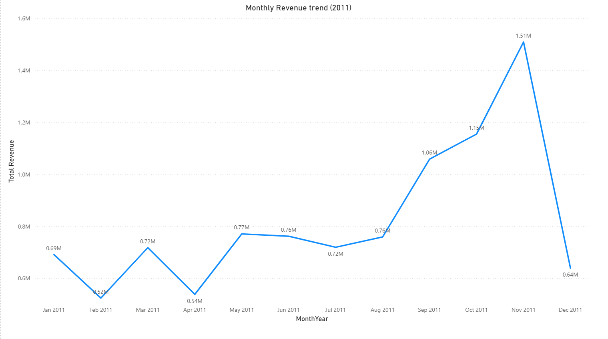
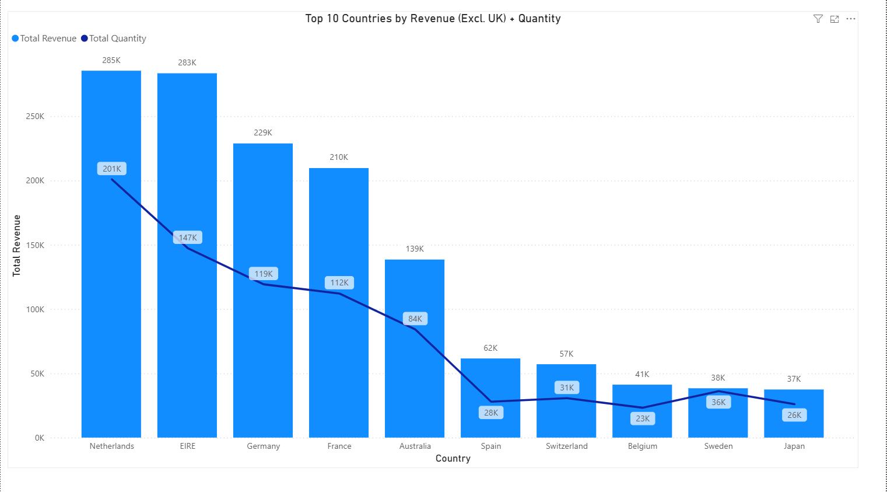
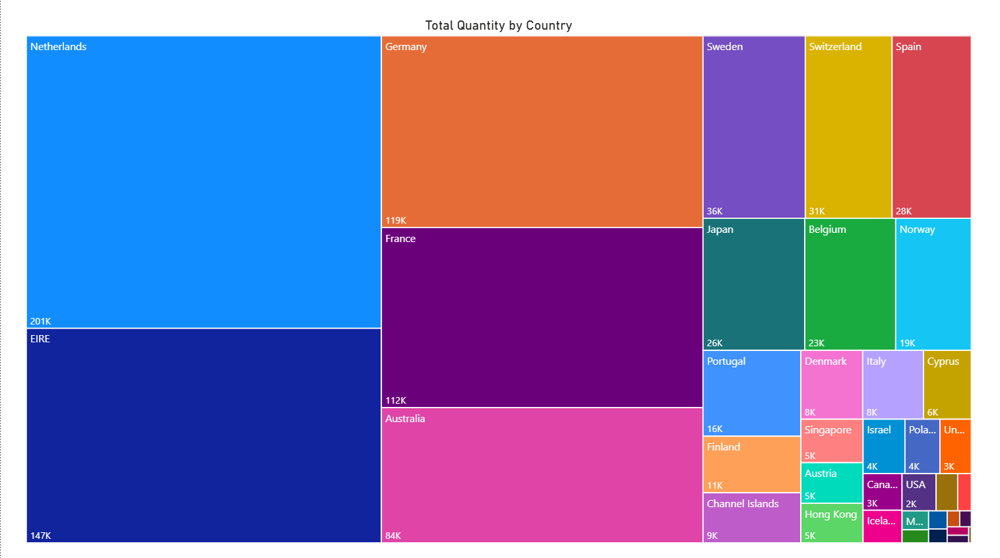

# Tata Forage – Data Visualisation Job Simulation (Power BI)

This repository contains my work for the **Tata Data Visualisation: Empowering Business with Effective Insights** job simulation on **Forage**, using the **Online Retail** dataset.

## Project Overview
Objective: Build executive-ready visuals to answer CEO/CMO questions on:
1. 2011 monthly revenue trend (seasonality)
2. Top 10 non-UK countries by revenue + quantity
3. Top 10 customers by revenue (ranked)
4. Demand by country (quantity) excluding the UK for expansion focus

## Data Cleaning (Power Query)
To improve data quality, I excluded:
- `Quantity < 1` (returns / negative quantities)
- `UnitPrice < 0` (invalid pricing)

I then used:
- `Revenue = Quantity * UnitPrice`
- Measures: `Total Revenue`, `Total Quantity`

## Key Insights (Summary)
- **Seasonality:** Revenue climbs from Aug and peaks in **Nov 2011**, then drops in Dec.
- **Top non-UK markets:** Netherlands and EIRE lead revenue, followed by Germany and France.
- **Customer concentration:** A small set of customers drives a significant share of revenue.
- **Demand hotspots:** Demand (quantity) is concentrated in a few countries, supporting targeted expansion.

## Screenshots
See: [`/screenshots`](./screenshots)
- Q1: Monthly Revenue Trend (2011)

  
- Q2: Top 10 Countries by Revenue (Excl. UK) + Quantity

  
- Q3: Top 10 Customers by Revenue

  
- Q4: Total Quantity by Country (Excl. UK)

## Files
- Power BI report: `powerbi/Shubhangi_Pawar_Tata_Forage_Task3.pbix` 
- Executive summary: `report/Executive_Summary.md`

## How to open the report
1. Download the `.pbix` file from the `powerbi/` folder.
2. Open it using **Power BI Desktop**.
3. Navigate through the pages: **Question 1 → Question 4**.

## Video walkthrough (Task 4)
- [Watch the video walkthrough] [(https://drive.google.com/file/d/1ezqsCSvRKKGRlqIpw9Bkda2ErD6M_IKc/view?usp=sharing)](https://drive.google.com/file/d/1ezqsCSvRKKGRlqIpw9Bkda2ErD6M_IKc/view?usp=sharing) 

## Dataset
Dataset is not included in this repository.  
Source: Online Retail dataset referenced in the Forage simulation resources (originally from the UCI repository).

## Certificate

## Author
Shubhangi Pawar
